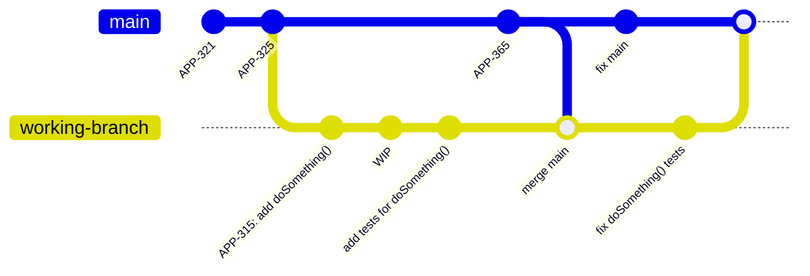
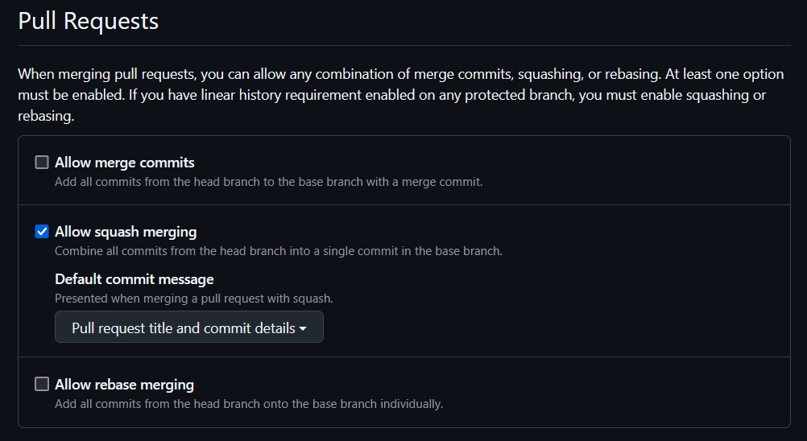
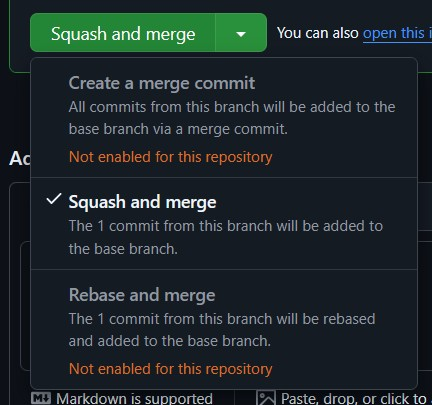
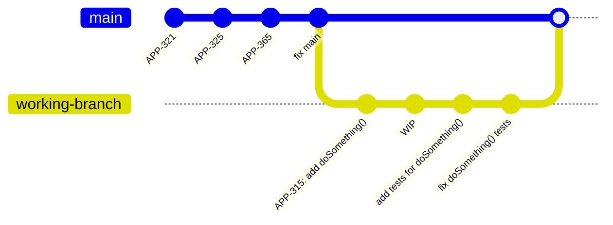

---
tags:
  - Git
  - Process
---
# Using the Squash Merge Strategy

## Assumed prior knowledge
To understand this page, it is assumed that you have a basic understanding of git branching and merging.

## TLDR

- Use the "squash and merge" option in your chosen remote version control solution as best practice when merging individual PRs.
- If your remote version control solution allows, restrict merges so this is the only option.
- If you're on the command line, the equivalent command is `git checkout target-branch && git merge working-branch --squash && git commit` to manually squash and merge `working-branch` into `target-branch`
- If your remote version control solution prevents squashed merges, consider squashing your commits before pushing and requesting review. 

## What is squashing in git?

In git, "squashing" a set of commits refers to the process turning those commits into a single equivalent commit.
There is no `git squash` command, but there is an option to `--squash` when performing certain other actions in git.
The main focus here is going to be squashed merges.

## Merging without squashing

Consider the following git graph where we create a branch named `working-branch`, make some commits, merge `main`, make another commit, then use a regular merge to merge the branch back into `main` (`git checkout main && git merge working-branch`):


We see that at the point where the branch `working-branch` is merged into `main`, the commit history will contain all commits from the branch.
Here is what `git log --oneline` outputs:
```
361a520 (HEAD -> main) Merge branch 'working-branch'
c58b907 (working-branch) fix doSomething() tests
 fix main
ab3853f Merge branch 'main' into working-branch
1667cd0 APP-365
1de0234 add tests for doSomething()
20cf7f2 WIP
2f0fde5 APP-315: add doSomething()
c3b49a2 APP-325
3273b5d APP-321
```

This works, but there are some flaws that compound as the size of the team working on your codebase grows.

### Broken and Meaningless Commits in History

First of all, if we are trying to hunt down a breaking change in our commit history, then we may run into issues with individual commits.
For example, look at that `WIP` commit.
That was someone saving some changes while working in a branch, but now it is a part of our main branch's history.
Does having a commit that just says `WIP` in its commit message add any value for us?
I'd argue that it is dead weight, at best.

What's more, do we trust that `WIP` will compile?
If it does compile, do we trust that it doesn't have broken behavior that was fixed in `working-branch` before it was merged?
If it does, then we might run into that broken behavior and decide to log it as a bug even though it is already fixed (and wasn't an issue for the latest commit of `main` at any point).
This can be mitigated by devs being disciplined with their individual commits, which could be enforced by running CI checks on every commit in a branch before allowing merges.
That's hardly a scalable solution.

### Non-Linear History

If you look at the git graph above, you'll notice that the history of `main` is not a straight line.
It has branches that leave and merge back into it.
That means that the context of any commit may or may not fit with the commits around it.
So, if I check out commit `c58b907` ("fix doSomething() tests"), do we actually have the changes from `f99f769` ("fix main")?
We didn't when `c58b907` was written, but it comes right after `f99f769` in the history of `main` as described by `git log --oneline`.

There are several strategies for maintaining a linear commit history.
One solution is to always rebase before (or during) merging of a branch.
There is a section below explaining why this may not be preferred.

The other alternative: "Squash and Merge"

## Squash and Merge
Now consider merging using the squash strategy.
The only thing that changes in our process is that rather than call `git checkout main && git merge working-branch` to merge our branch, we call `git checkout main && git merge working-branch --squash && git commit -m "APP-315 add doSomething() and tests"` (or, more realistically, you use the "Squash and Merge" option of your remote version control).
Calling `git merge working-branch --squash` ([docs](https://git-scm.com/docs/git-merge#Documentation/git-merge.txt---squash)) takes all of the commits in the `working-branch` branch and "squashes" them into a single commit, which then gets staged at the head of your currently checked out branch.
This leaves us with the following git graph
```mermaid
gitGraph
    commit id:"APP-321"
    commit id:"APP-325"
    branch APP-315
    commit id:"APP-315: add doSomething()"
    commit id:"WIP"
    commit id:"add tests for doSomething()"
    checkout main
    commit id:"APP-365"
    checkout working-branch
    merge main id:"merge main"
    commit id:"fix doSomething() tests"
    checkout main
    commit id:"fix main"
    commit id:"APP-315 add doSomething() and tests"
```

That last commit in the `main` branch represents all of the work that was done in the `working-branch` branch, but does not introduce the entire history of that branch into `main`.
The `working-branch` branch and its commits do all still exist, though, if we should need that history for some reason.
We now get a `git log --oneline` from the `main` branch that looks like this:

```
e5ace53 (HEAD -> main) APP-315 add doSomething() and tests
f99f769 fix main
1667cd0 APP-365: add bar
c3b49a2 APP-325
3273b5d APP-321
```
So now the git history has a single commit that represents merging branch `working-branch`.

In a code base where the main branch is properly protected from commits that have not been reviewed and put through a pull request process, squashing all merges means that every commit represents the summation of work from a reviewed PR.
That is, when you review a PR you know that the changes you are looking at are going to be exactly the changes in the single commit that goes into the main branch.
This means that every commit is a fully reviewed unit that can be traced directly back to its PR (which should ideally be referenced in the commit message).

Let's go back to the question of how we search for where a regression was introduced.
Every commit in our history should theoretically be buildable and testable (assuming a sufficient CI/CD pipeline and protections for the main branch, e.g. a merge queue).
So now we can check all[^1] commits between when we know the main branch was fine and when we know for sure there is a regression to find the commit that introduced the regression.
That commit that introduced the regression is associated directly with a reviewed PR that we can now look at to understand the full context of the changes that were made and what was/wasn't considered in relation to the regression that was introduced. 
If we need to get more granular about the commits that occurred in the branch, those are still available in the PR.

## Should we squash every merge?
If you have a development pattern where every pull request into the main branch is a singular unit of work, then yes.
However, if you use feature branches that you target with pull requests until the feature is ready and then merge that branch into the main branch, then the answer changes to a "maybe".
It is likely worth keeping the history of the pull requests into the feature branch when you merge it into your main branch, so the final pull request that merges the feature branch into the main branch perhaps shouldn't be squashed.
Every pull request that is made _into_ the feature branch should be squashed, though.
The goal here is to reduce the noise from the working branches and unreviewed individual commits.

## Squashed merges and your remote tracking system

Most remote trackers (GitHub, GitLab, BitBucket, etc.) have built-in support for doing squashed merges.

### GitHub

On GitHub, you can set repository settings to allow/disallow regular merges, squashed merges, and rebased merges.
These settings can be found under the "General" area of the "Settings" tab on your repo (as an administrator):


As long as squash merges are allowed, you can select it as your merge strategy when merging a pull request.
Simply click the arrow next to the merge button and you will be given a chance to select your merge strategy from those allowed by the repository settings:


## Squashing a Branch Before Submitting a PR

If you are in a situation where you work best with a messy on-branch commit history, but your team is against squashed merges, then you can manually squash your branch before requesting a review.
To do this, just use `git reset --soft target-branch`, which will rewind to the latest commit of `target-branch`, but leave all of your working files as-is, meaning they are now staged to be added in one single commit (or a couple if you'd like to just re-organize your commit history rather than fully squash it).
If your remote repository allows for forced pushes on working branches, you can even rewrite your branch that has already been pushed.
Although, be wary of doing that for a branch that has already entered the review stage, as that can affect your review.

## Rebase + Merge
For completeness, I should also explain a rebasing merge strategy, as remote tracking tools will have a "rebase and merge" option as well.
If we use that option to merge `working-branch`, from the earlier example, into `main`, then it will run a command along the lines of `git checkout working-branch && git rebase main && git checkout main && git merge working-branch`.
As we can see, this performs a normal git merge, but first "rebases" the working branch.
All `git rebase branch-name` does is move the base commit of your working branch to the end of the given branch, so doing a rebase merge will keep your entire branch history but will prevent interleaving your branch's commits with commits already in `main`.
Doing a rebase commit with the example above will result in the following commit history:



The output of `git log --oneline`:
```
c58b907 (HEAD -> main, working-branch) fix doSomething() tests
1de0234 add tests for doSomething()
20cf7f2 wip
2f0fde5 APP-315: add doSomething()
f99f769 fix main
1667cd0 APP-365: add bar
c3b49a2 APP-325
3273b5d APP-321
```

As we can see, this is still a cleaner history than a regular in-place merge, but not as clean of a history as squashed merges.

There are some other considerations, though.
Rebasing can easily result in conflicts with your commits and the branch you're rebasing on.
In these cases, you'll have to resolve that conflict, which creates a new commit that replaces the original one in the history of your branch.
That can also affect the final outcome of the sequence of commits if you're not careful, meaning you had one reviewed set of changes, but in the rebase process something changed and then perhaps got missed before being merged.
This is an easy way to get unexpected regressions in your main branch.

Compare that to squashed merges, where the final outcome of the sequence of commits in your branch is the only thing that matters.


[^1]: In reality, we should only need to check $log_2(N)$ commits, where $N$ is the number of commits, if you're doing a binary search as with `git bisect`.